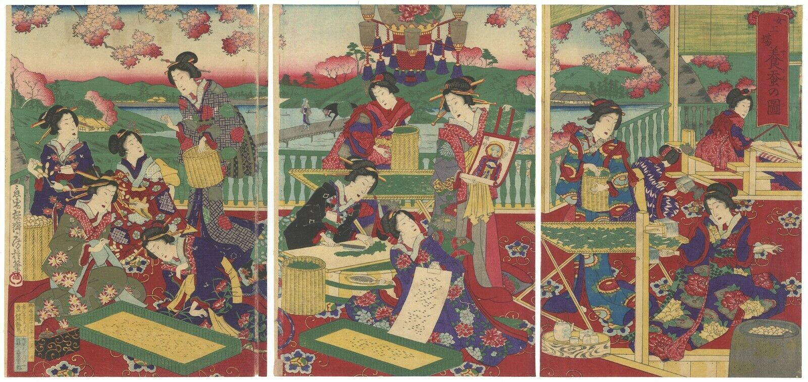

<b>Painter:</b> Utagawa Fusatane (歌川房種) 
<b>Publisher:</b> Morimoto Junzaburo (森本順三郎)

<b>Text:</b> 
Signature: Ōju Ōsai Fusatane hitsu (應需桜斎房種筆 [応需桜斎房種筆]) 
Publication date: 御届明治十三年十一月 ... 日 (Ontodoke, date for notice of registration; Meiji 13 year, 1880; 11 month, November; ... day) 
Publisher (top): 画工 (gakō, painter) 村井静馬 (Murai Seima, Fusatane’s original name) followed by address 
Publisher (bottom): 出版人 (??, publisher) 森本順三郎 (Morimoto Junzaburo) followed by address

<b>Description:</b> 
...

<b>Size of the original:</b> 
(L) 34.2 × 24.3, (C) 34.2 × 24.3, (R) 34.2 × 24.2 cm

<b>Condition:</b> 
pinhole, lightly colour running, vertical crease on the left panel, light tears, light stains due to colour oxidisation

<b>Sources:</b> 
https://archives.tuat-museum.org/s/da/item/1342 
https://cultural.jp/en/item/Nhikie-2018_u_0031
