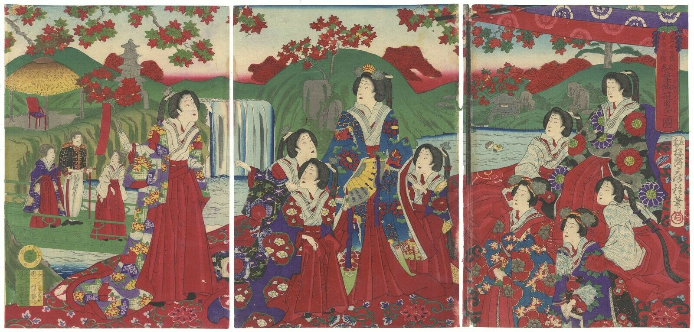

<b>Text:</b> 
Signature: Ōju Ōsai Fusatane hitsu (應需櫻斎房種筆 [応需桜斎房種筆]) followed by red sign of the artist 
Publication date: 御届明治十二年八月 ... 日 (Ontodoke, date for notice of registration; Meiji 12 year, 1879; 8 month, August; ... day) 
Publisher (left): 版元 [publisher] 石川虎吉 [Ishikawa Torakichi] followed by address 
Publisher (right): 画工 [painter] 村井静馬 [Murai Seima, Fusatane's original name] followed by address 

<b>Description:</b> 
on the right chair, the Empress Dowager Eishō (英照皇太后, Eishō-kōtaigō), wife (妃) of the Emperor Kōmei (孝明天皇, Kōmei-tennō); in the central chair, Empress Dowager Akinori or Empress Shōken (昭憲皇太后, Shōken-kōtaigō), wife (妃) of the Emperor Meiji (明治天皇, Meiji-tennō) ??

<b>Size of the original:</b> 
(L) 34.4 × 23.9 cm, (C) 34.3 × 24.0 cm, (R) 34.2 × 24.2 cm

<b>Condition:</b> 
watermarks, lightly colour running, vertical crease and light tears on the right panel

<b>Sources:</b> 
https://collections.mfa.org/objects/129813
